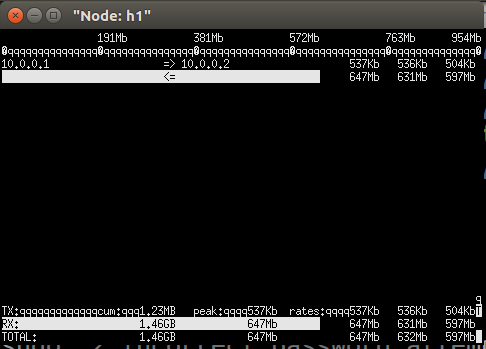
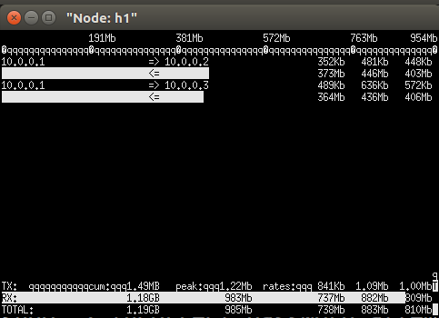
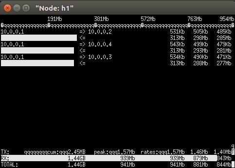

# 1. topo
```
s1
+- h1
+- h2
+- h3
\- h4
```
h1 s1 delay 25ms  
h2 s1 delay 25ms  
h3 s1 delay 25ms  
h4 s1 delay 25ms  
# 2. Throughput
## 2.1 TCP

| No | Hosts | Throughput | File |  
| -- | -- | -- | -- |  
| 1 | 2 | 600Mbps | tcp/1Gbps_50ms_TCP_2host_600Mbps.png |  
| 2 | 3 | 880Mbps | tcp/1Gbps_50ms_TCP_3host_880Mbps.png |
| 3 | 4 | 880Mbps | tcp/1Gbps_50ms_TCP_4host_880Mbps.png |  

2 hosts  
  
3 hosts  
  
4 hosts  
  

## 2.2 UDT
