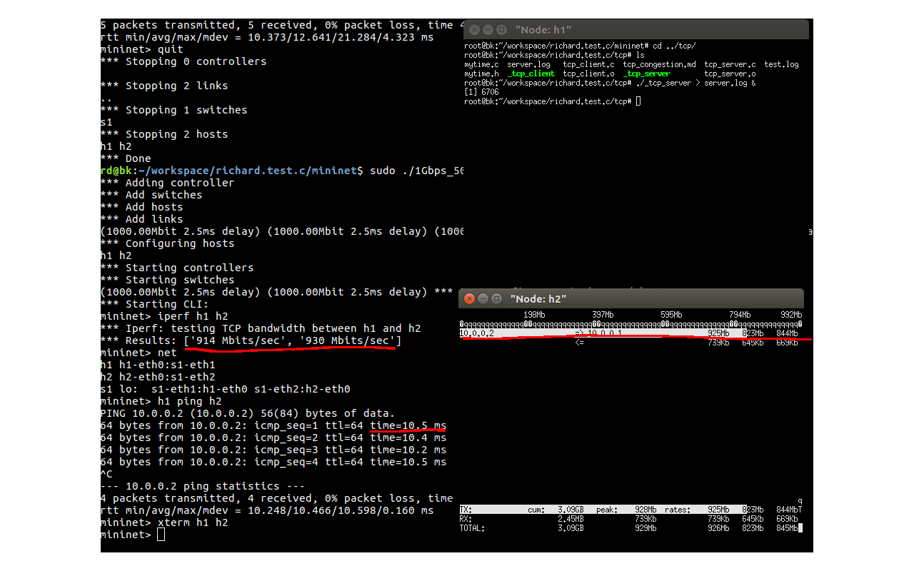
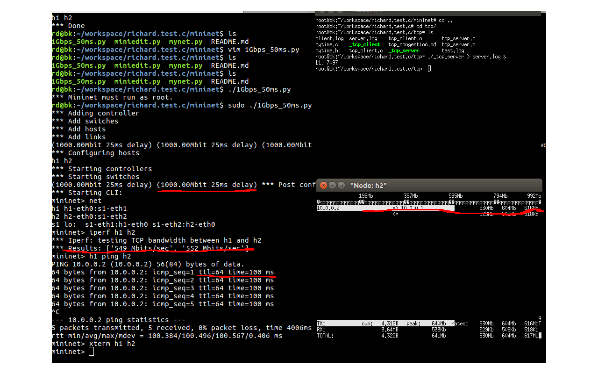
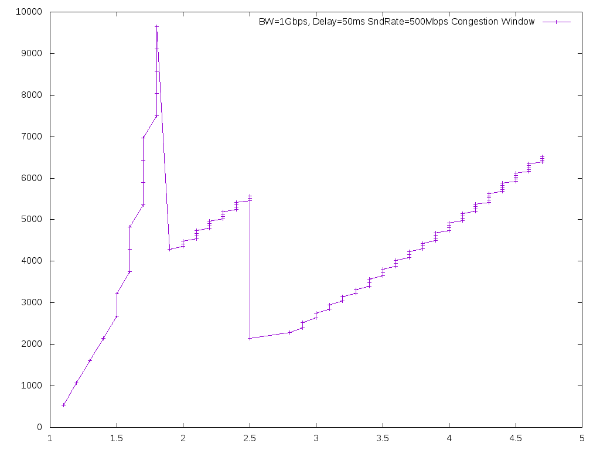

# 1. TCP test
# 1.1 长肥网络（LFN，long fat network）throughput test
 测试结构如下表所示  

| Bandwidth | Delay | Protocol | Throughput |  
| --- | ---| --- | ---|  
| 1Gbps | 5ms | TCP | 900Mbps |  
| 1Gbps | 50ms | TCP | 600Mbps |  

1Gbps 5ms 网络吞吐量测试结果如下图  

1Gbps 50ms 网络吞吐量测试结果如下图  

# 1.2 Congestion window
Test condition

| Bandwidth | Delay | Protocol | packtSize |  packetSnd | sndRate | file |
| --- | ---| --- | ---| --- | --- | --- |  
| 1Gbps | 5ms | TCP | 1040byte |  1000 | 1Mbps | cwnd1Mbps.png |
| 1Gbps | 5ms | TCP | 1040byte |  1000 | 500Mbps | cwnd500Mbps.png |

Congestion windows size changed as following  
Send rate as 1Mbps   
   
Send rate as 500Mbps  

