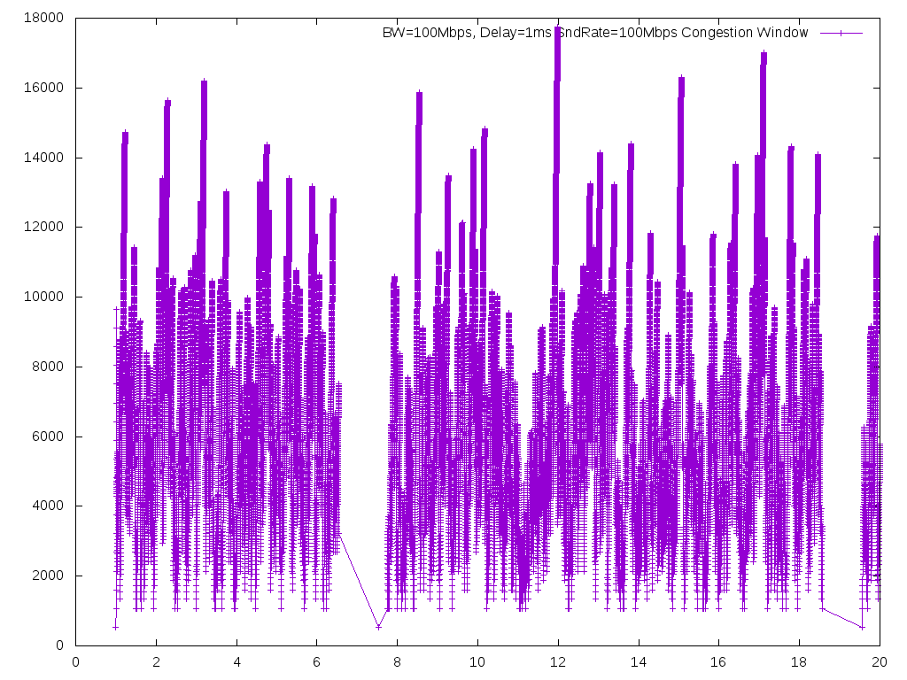

# 1. TCP Test
# 1.1 长肥管道网络（LFN，long fat network）throughput test
 测试结果如下表所示  

| Bandwidth | Delay | Protocol | Throughput |  File |
| --- | ---| --- | ---|  -- |
| 1Gbps | 5ms | TCP | 900Mbps |  1Gbps_5ms_mark.png |
| 1Gbps | 50ms | TCP | 600Mbps |  1Gbps_50ms_mark.png |

1Gbps 5ms 网络吞吐量测试结果如下图  


1Gbps 50ms 网络吞吐量测试结果如下图  


# 1.2 Congestion Window
Test condition

| Bandwidth | Delay | packetSize  | dataRate | File |
| --- | ---| --- | --- | --- |  
| 100Mbps | 1ms | 1040byte | 100Mbps | tcp/cwnd100Mbps1ms.png |
| 1Gbps | 5ms | 1040byte | 500Mbps | tcp/cwnd1Gbps5ms.png |
| 1Gbps | 50ms | 1040byte | 500Mbps | tcp/cwnd1Gbps50ms.png |

Congestion windows size changed as following   
  
  
  
# 2. UDT
## 2.1 network traffic
```
ifstat -i lo
```
