# 1. topo

topo as following  

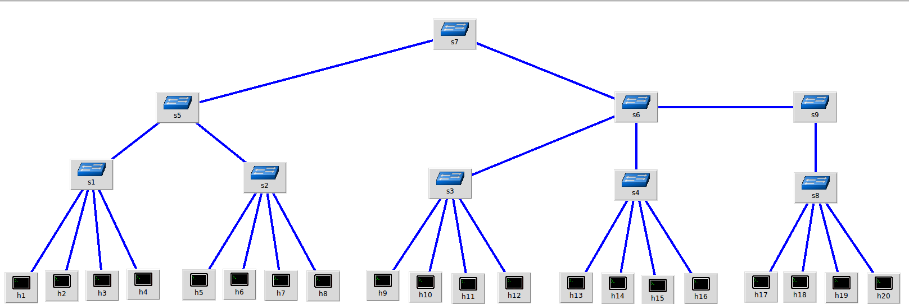  

end to end network as table below:  

| No| From  | To | Delay(ms) | Bandwidth(Mbps) |   
| --| -- | -- | -- | -- |  
| 1 | h1 | h2 | 2 | 1000 |   
| 2 | h1 | h5 | 20 | 1000 |  
| 3 | h1 | h9 | 30 | 1000 |  
| 4 | h1  | h13 | 40 | 1000 |  
| 5 | h1 | h17 | 50 | 1000 |  

# 2. TCP Fairness  
setup 5 concurrent flow, traffic distribution as following  
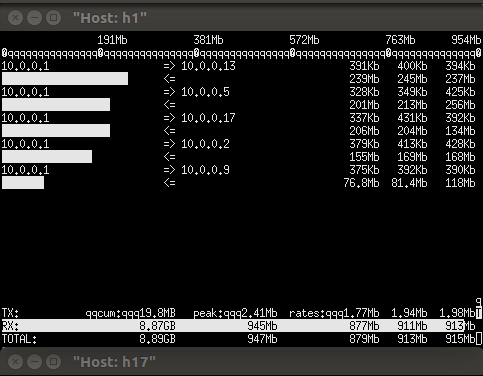  

throughput faireness details as below

| No  | delay(ms) |  throughput_AVG(Mbps) |  
| -- | -- | -- |  
| 1 | 2 | 202 |  
| 2 | 20 | 330 |  
| 3 | 30 | 150 |  
| 4  | 40 | 127 |  
| 5 | 50 | 129 |   

2ms  
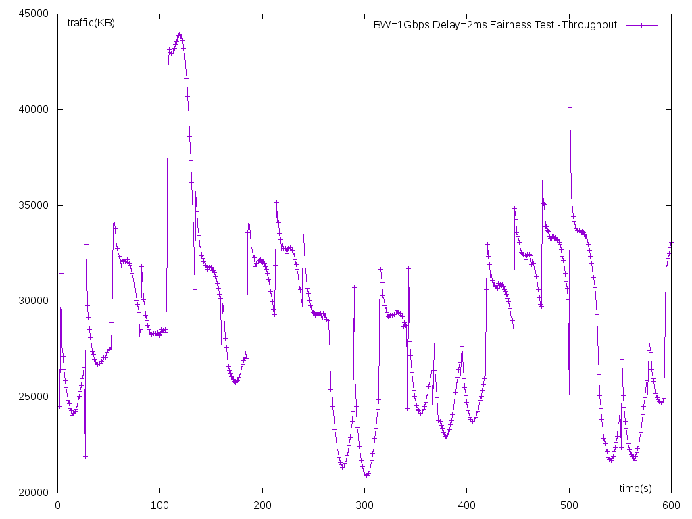  

20ms  
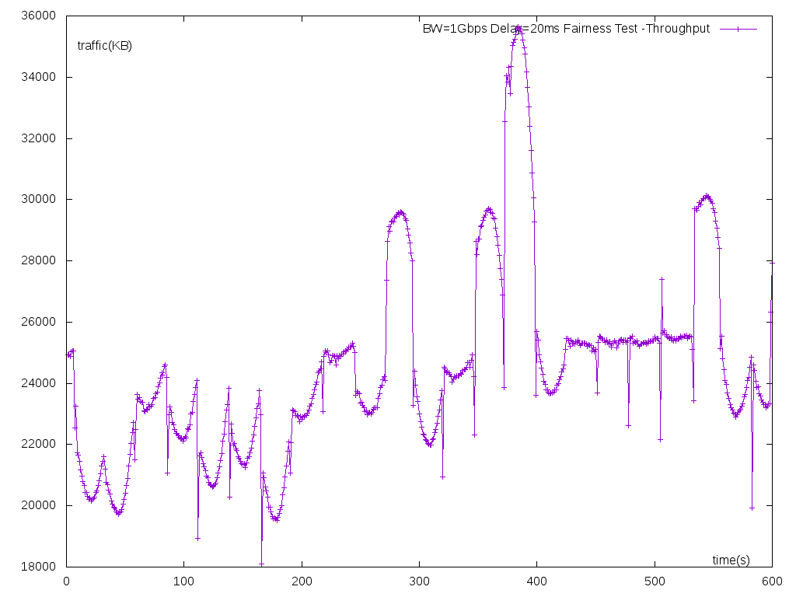  

30ms  
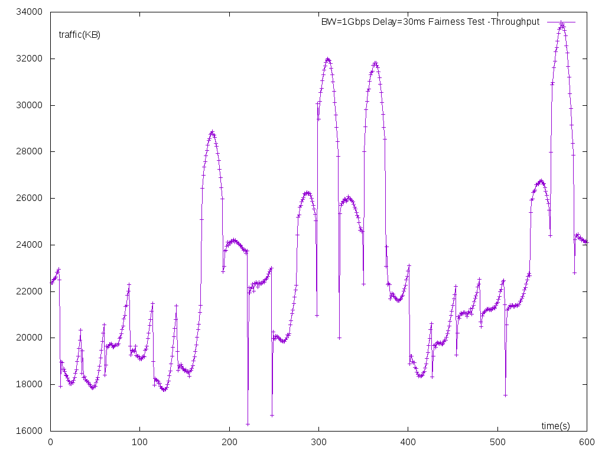  

40ms  
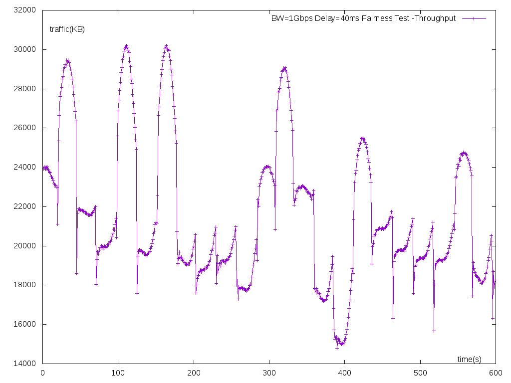  

50ms  
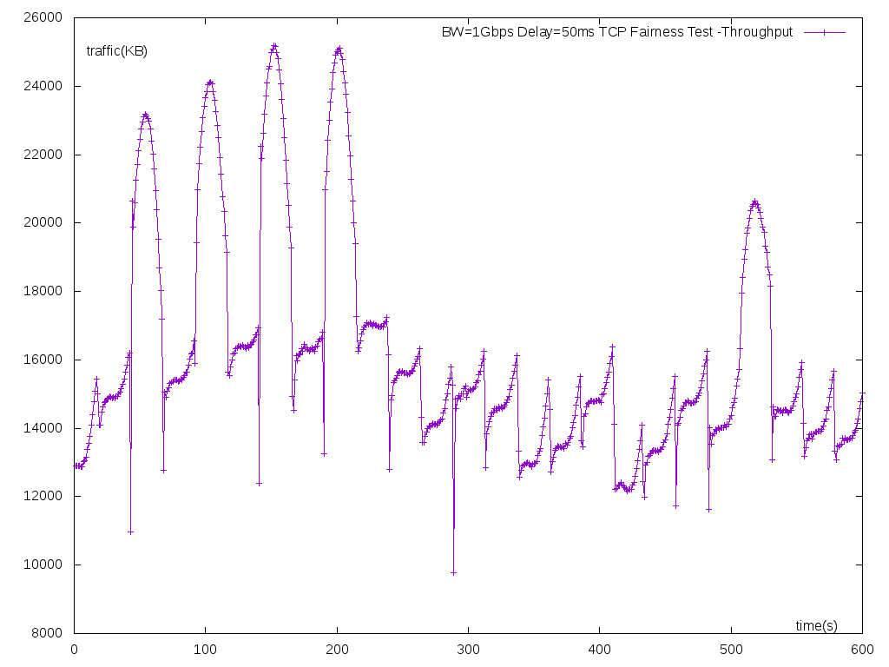  

# 3. UDT Fairness

setup 5 concurrent flows, traffic distribution as following  
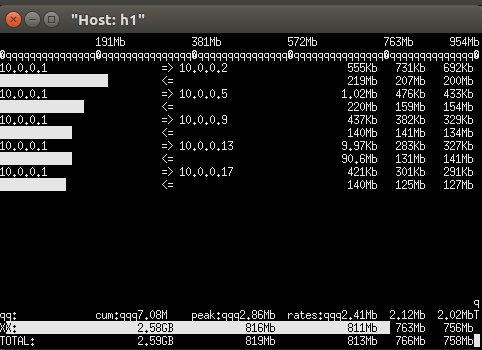  

throughput faireness details as below

| No  | delay(ms) |  throughput_AVG(Mbps) | 下降比例 (%)|
| -- | -- | -- | -- |  
| 1 | 2 | 233 | 0 |  
| 2 | 20 | 189 | 19 |  
| 3 | 30 | 170 | 27 |  
| 4  | 40 | 167 | 28 |  
| 5 | 50 | 161 | 31 |   

2ms  
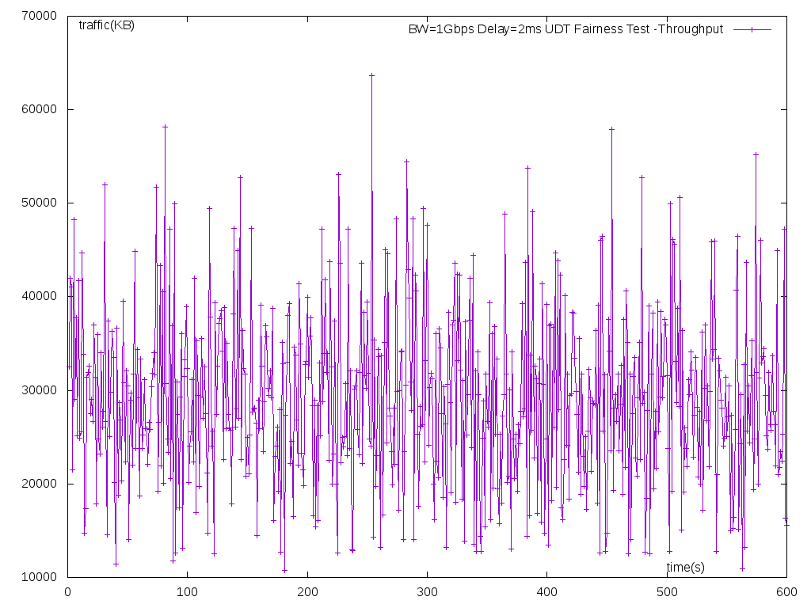  

20ms  
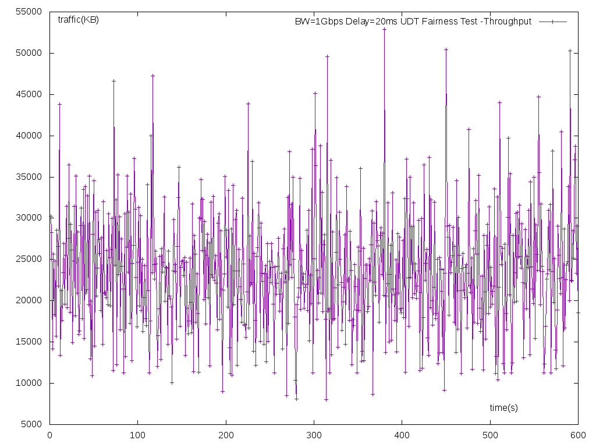  

30ms  
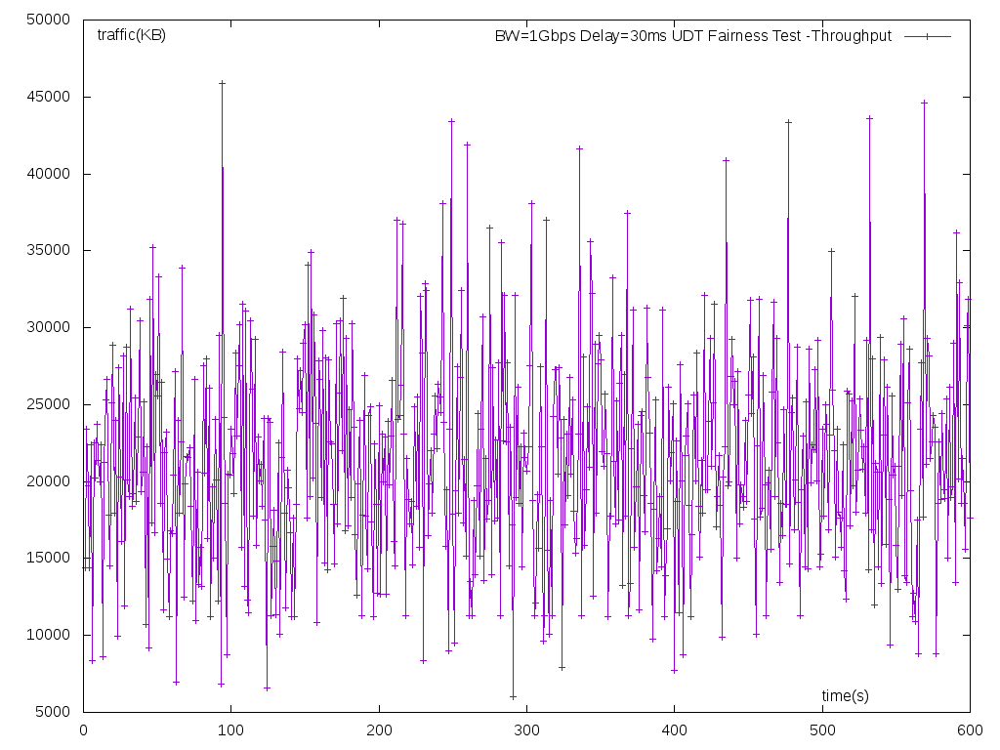  

40ms  
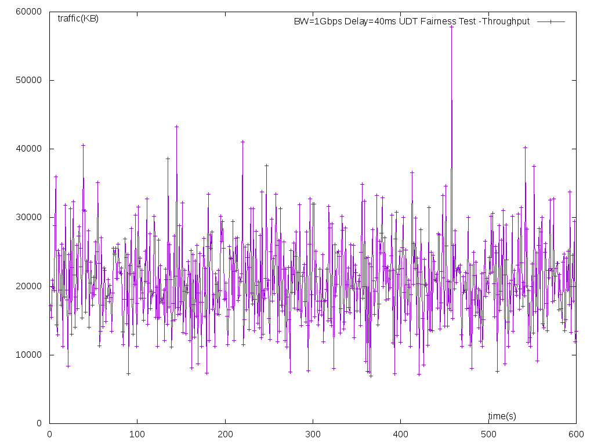  

50ms  
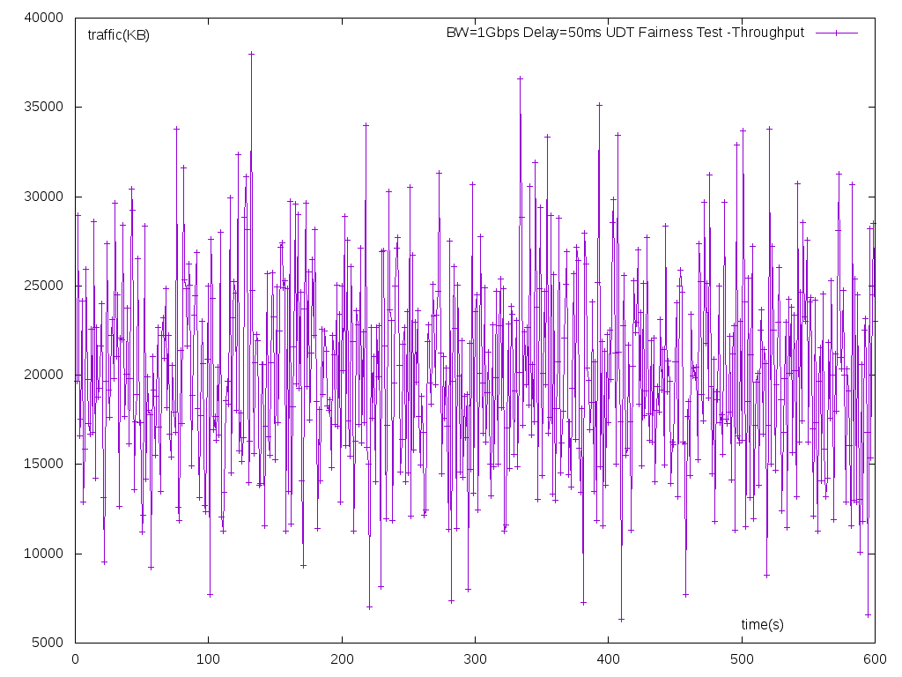  

# 4. conclusion

| No  | delay(ms) |  TCP throughput_AVG(Mbps) | UDT throughput_AVG(Mbps) |  
| -- | -- | -- | -- |  
| 1 | 2 | 202 | 233 |  
| 2 | 20 | 330 | 189 |  
| 3 | 30 | 150 | 170 |  
| 4  | 40 | 127 | 167 |  
| 5 | 50 | 129 | 161 |
|sum| - | 938| 920  |    

在带宽相同的条件下，TCP 拥塞控制算法(cube) 会为延迟较小的节点分配较高的带宽        UDT的拥塞控制也有这个趋势，但是带宽分配随延迟的变化幅度较小  
