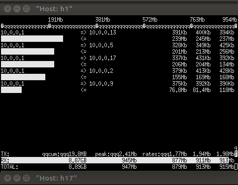

# 1. topo

topo as following  

  

end to end delay as table below:  

| No| from  | to | delay(ms) |  
| --| -- | -- | -- |  
| 1 | h1 | h2 | 2 |  
| 2 | h1 | h5 | 20 |  
| 3 | h1 | h9 | 30 |  
| 4 | h1  | h13 | 40 |  
| 5 | h1 | h17 | 50 |  

# 2. TCP Faireness  

setup 5 concurrent flow, traffic distribution as following  
  

throughput faireness details as below

| No  | delay(ms) |  throughput(Mbps) |  
| -- | -- | -- |  
| 1 | 2 | 240 |  
| 2 | 20 | 190 |  
| 3 | 30 | 180 |  
| 4  | 40 | 160 |  
| 5 | 50 | 140 |   

2ms  
  

20ms  
  

30ms  
  

40ms  
  

50ms  
  

# 3. conclusion
With the same bandwith, TCP congestion control would distribute  
more bandwith to the end with smaller delay time.
