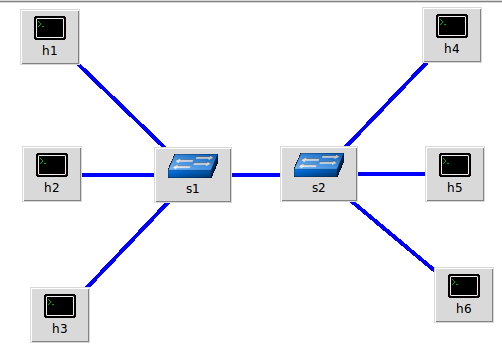
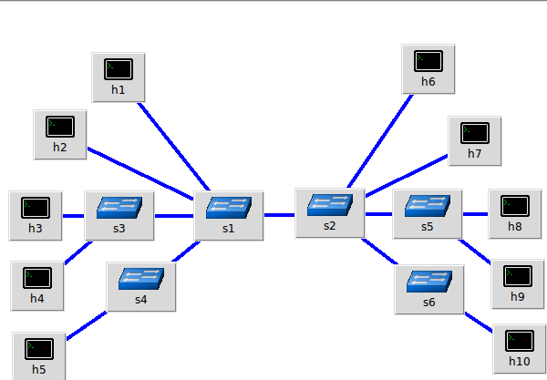
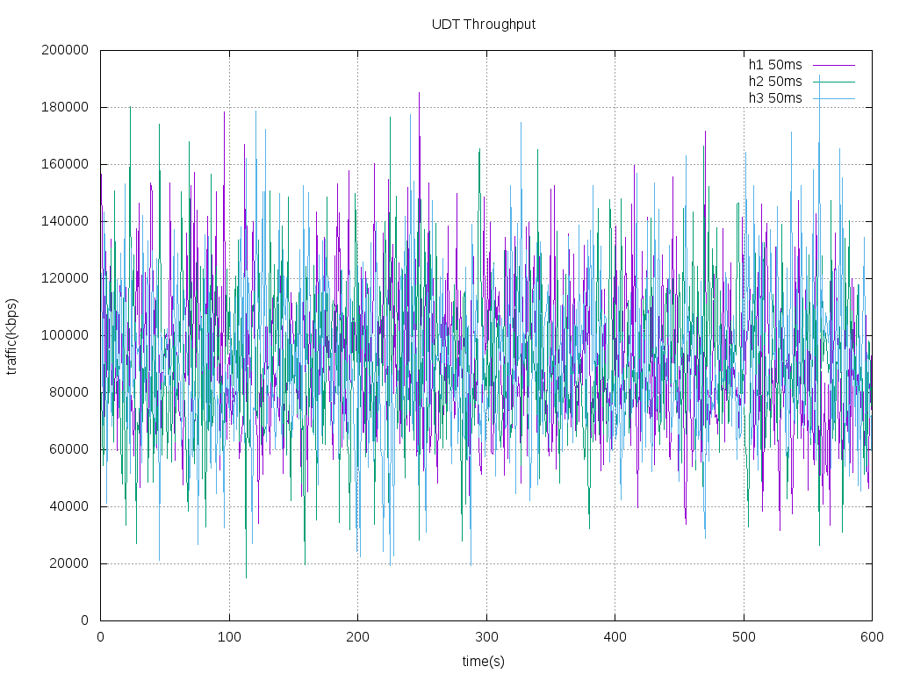
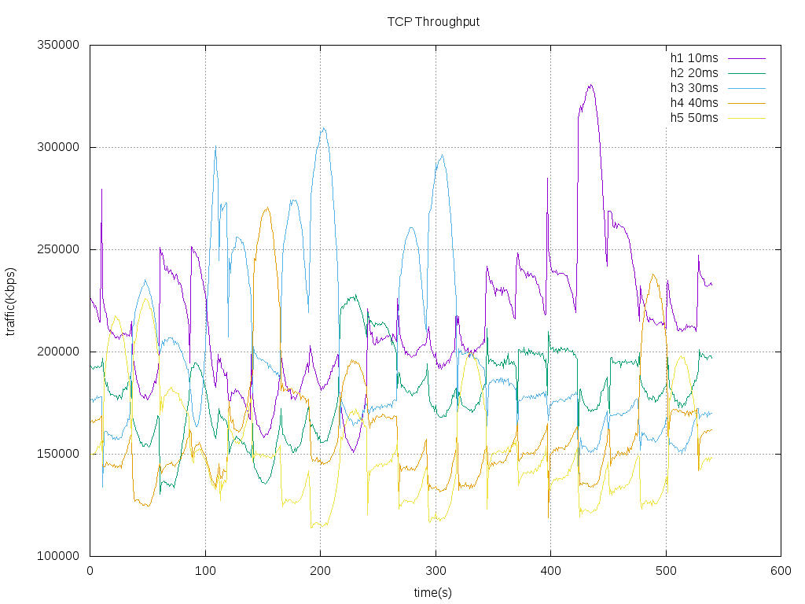
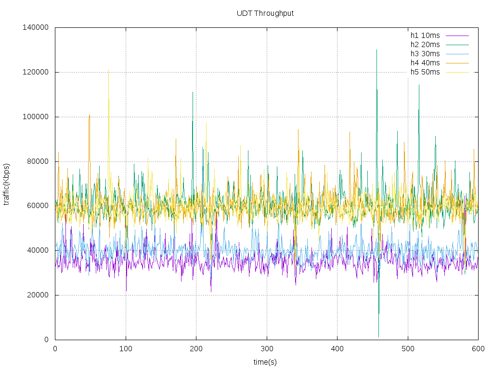

# 1. Context

验证同样的带宽，在一个背景流量已经占用的情况下，后启动的业务是否能够获取到流量

# 2. topo
## 2.1 同等网络延迟拓扑
1Gbps 50ms, 多台server， 多台客户端，在客户端和server 中间共享一条链路,如图2-1所示  

  

 图 2-1 同等网络延迟拓扑 

## 2.2 不同网路哦延迟拓扑
 5台客户端，5台服务端，在客户端和服务端中间共享一条链路，如下图所示
   
 
 图 2-2 不同网络延迟拓扑 

# 3. 相同延迟条件下带宽分配  

网络拓扑如图2-1所示。  

## 3.1 TCP   

设定带宽及延迟以及平均吞吐量如下表所示  

| No | From | To | Bandwidth | Delay | Throughput_AVG(Mbps) |  
| -- | -- | -- | -- | -- | -- |  
| 1 | h1 | h4 | 1Gbps | 50ms | 307 |  
| 2 | h2 | h5 | 1Gbps | 50ms | 307 |  
| 3 | h3 | h6 | 1Gbps | 50ms | 308 |  
| 4 | s1 | s2 | 1Gbps | 30ms | 922 |  

分别在 h4-h1, h5-h2, h6-h3之间建立3个TCP流，3个流占用的带宽如下图所示  

## 3.2 UDT  

设定带宽及延迟,以及平均吞吐量如下表所示  

| No | From | To | Bandwidth | Delay | Throughput_AVG |   
| -- | -- | -- | -- | -- |  
| 1 | h1 | h4 | 1Gbps | 50ms | 91.6 |  
| 2 | h2 | h5 | 1Gbps | 50ms | 90.1 |  
| 3 | h3 | h6 | 1Gbps | 50ms | 91.3 |  
| 4 | s1 | s2 | 1Gbps | 30ms | 272.9 |  

分别在 h4-h1, h5-h2, h6-h3之间建立3个 UDT流，每个UDT的发送速率设置为800Mbps，3个流占用的带宽如下图所示  

# 4. 不同延迟条件下带宽分配  

网络拓扑如图2-2所示。  

## 4.1 TCP   

设定带宽及延迟以及平均吞吐量如下表所示  

| No | From | To | Bandwidth | Delay | Throughput_AVG(Mbps) |  
| -- | -- | -- | -- | -- | -- |  
| 1 | h1 | h6  | 1Gbps | 10ms | 214 |  
| 2 | h2 | h7  | 1Gbps | 20ms | 180 |  
| 3 | h3 | h8  | 1Gbps | 30ms | 200 |  
| 4 | h4 | h9  | 1Gbps | 40ms | 161 |  
| 5 | h5 | h10 | 1Gbps | 50ms | 152 |  
| 6 | s1 | s2 | 1Gbps | 10ms | 907 |  

分别在 h1-h6, h2-h7, h3-h8, h4-h9, h5-h10 之间建立 5 个TCP流，  
5个流占用的带宽如下图所示  

## 4.2 UDT
设定带宽及延迟以及平均吞吐量如下表所示  

| No | From | To | Bandwidth | Delay | Throughput_AVG(Mbps) |  
| -- | -- | -- | -- | -- | -- |  
| 1 | h1 | h6  | 1Gbps | 10ms | 35 |  
| 2 | h2 | h7  | 1Gbps | 20ms | 61 |  
| 3 | h3 | h8  | 1Gbps | 30ms | 40 |  
| 4 | h4 | h9  | 1Gbps | 40ms | 60 |  
| 5 | h5 | h10 | 1Gbps | 50ms | 59 |  
| 6 | s1 | s2 | 1Gbps | 10ms | 256 |  

分别在 h1-h6, h2-h7, h3-h8, h4-h9, h5-h10 之间建立 5 个UDT流，  
5个流占用的带宽如下图所示  

