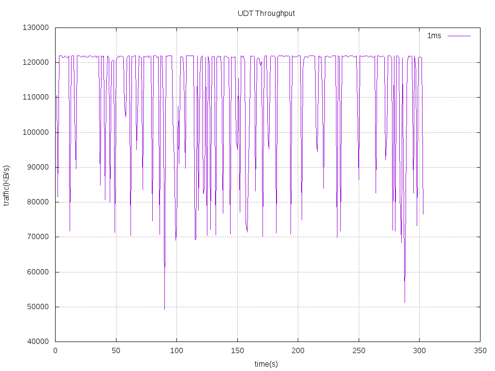

# 1. Topo
```
s1
+- h1 server
+- h2 client
```
h1 s1 delay 25ms
h2 s1 delay 25ms
# 2. TCP Test

# 2.1 LFN(long fat network) TCP throughput test

 测试结果如下表所示  

| Bandwidth | Delay | Protocol | Congetion Control | Throughput |  File |  note |  
| --- | ---| --- | ---|  -- | --|
| 1Gbps | 5ms   | TCP | BBR | 900Mbps |   tcp/tcp_traffic_1Gbps_5ms.png                   | 1 channel |  
| 1Gbps | 50ms  | TCP | BBR | 600Mbps |   tcp/tcp_traffic_1Gbps_50ms.png                  | 1 channel |  
| 1Gbps | 50ms  | TCP | BBR | 930Mbps |   tcp/tcp_traffic_1Gbps_50ms_multi_channel.png    | 4 channel |  
| 1Gbps | 1ms   | UDT | -- | 440Mbps |   udt/udt_traffic_1Gbps_1ms.png                   | 1 channel |  
| 1Gbps | 50ms  | UDT  | --| 240Mbps |   udt/udt_traffic_1Gbps_50ms.png                  | 1 channel |  

1Gbps 5ms 网络吞吐量测试结果如下图  
  

1Gbps 50ms 网络吞吐量测试结果如下图  
单通道  
  

4通道  
  

# 2.2 Congestion Window  

Test condition  

| Bandwidth | Delay | packetSize  | dataRate | File |  
| --- | ---| --- | --- | --- |  
| 100Mbps | 1ms | 1040byte | 100Mbps | tcp/cwnd100Mbps1ms.png |  
| 1Gbps | 5ms | 1040byte | 500Mbps | tcp/cwnd1Gbps5ms.png |  
| 1Gbps | 50ms | 1040byte | 500Mbps | tcp/cwnd1Gbps50ms.png |  

Congestion windows size changed as following  
100Mbps, delay 1ms  
  
1Gbps, delay 5ms  
  
1Gbps, delay 50ms  
  

# 3. UDT  

## 3.1 network traffic  

UDT throughput test as below

| Bandwidth | Delay | Protocol | Throughput |  File |  
| --- | ---| --- | ---|  -- |  
| 1Gbps | 1ms | UDT | 440Mbps | udt/udt_traffic_1Gbps_1ms.png |  
| 1Gbps | 50ms | UDT | 240Mbps | udt/udt_traffic_1Gbps_50ms.png |  

1Gbps 1ms 网络吞吐量测试结果如下图  
  
1Gbps 50ms 网络吞吐量测试结果如下图  
  
