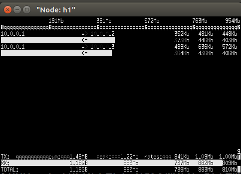
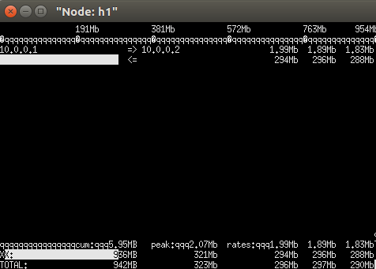
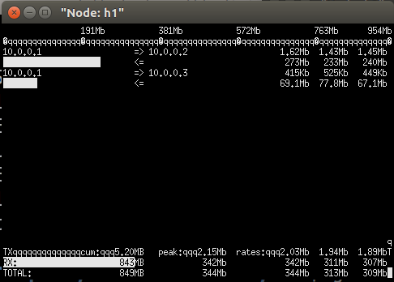
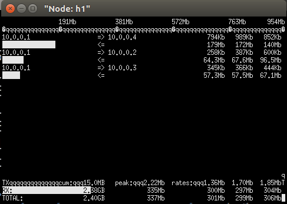

# 1. topo

```
s1
+- h1
+- h2
+- h3
\- h4
```
h1 s1 delay 25ms  
h2 s1 delay 25ms  
h3 s1 delay 25ms  
h4 s1 delay 25ms  

# 2. Throughput  
## 2.1 TCP  

| No | Hosts | Throughput | Congestion Control | File |  
| -- | -- | -- | -- | -- |
| 1 | 2 | 600Mbps | BBR | tcp/1Gbps_50ms_TCP_2hosts_600Mbps.png |  
| 2 | 3 | 880Mbps | BBR | tcp/1Gbps_50ms_TCP_3hosts_880Mbps.png |
| 3 | 4 | 880Mbps | BBR | tcp/1Gbps_50ms_TCP_4hosts_880Mbps.png |  

2 hosts  
  

3 hosts  
  

4 hosts  
  

## 2.2 UDT  

| No | Hosts | Throughput | File |  
| -- | -- | -- | -- |  
| 1 | 2 | 300Mbps | udt/1Gbps_50ms_UDT_2hosts_300Mbps.png |  
| 2 | 3 | 300Mbps | udt/1Gbps_50ms_UDT_3hosts_300Mbps.png |
| 3 | 4 | 300Mbps | udt/1Gbps_50ms_UDT_4hosts_300Mbps.png |  

2 hosts  
  

3 hosts  
  

4 hosts  
  
